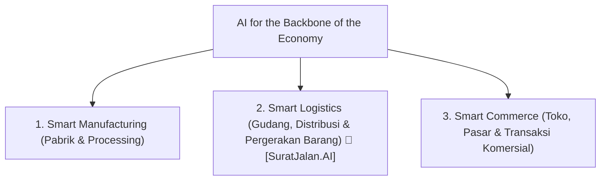

# 🏛️ COMPFEST 18 AI Innovation Challenge (AIC) — Context & Competition Rules

> **Host**: Fakultas Ilmu Komputer, Universitas Indonesia (Fasilkom UI)  
> **Theme**: *AI for the Backbone of the Economy*  
> **Tagline**: `#EncloseTheGap`  
> **Branch**: AI Innovation Challenge (AIC)

---

## 1. 🎯 Theme & 3 Strategic Pillars

The competition challenges participants to develop AI-driven innovations that transform Indonesia's business value chains across 3 post-primary supply chain areas:

---

## 2. ⚡ Strict MVP Scope Boundaries (Preliminary Stage)

To ensure local reproducibility and clean engineering, the AIC committee enforces strict MVP boundaries:

1. **Frontend (FE)**:
   - UI must focus exclusively on the **core interaction flow** (Single User Input $\rightarrow$ AI Inference $\rightarrow$ Output Visualization).
   - Do NOT build over-complicated authentication (RBAC), multi-tenant user history, or bloated analytics dashboards.
2. **Backend (BE)**:
   - Synchronous API interaction. Must run cleanly via `docker compose` or single-command local script.
   - Do NOT build distributed databases, Kafka/Celery background job clusters, or heavy auto-logging infra.
3. **AI Models & Algorithms**:
   - Focus on clean **core inference** with static demonstration parameters.
   - Pre-trained models / APIs are allowed, but must be fine-tuned or adapted specifically to the feature innovation.

---

## 3. 📊 Official Scoring Rubric Breakdown (Total 105%)

| Weight | Criteria | Key Evaluation Questions |
| :---: | :--- | :--- |
| **25%** | **Teknologi & Kematangan Arsitektur** | Modular architecture (FE, BE, AI cleanly separated), robust core inference, seamless Docker Compose setup & README. |
| **20%** | **Orisinalitas & Dampak Sosial** | Uniqueness of approach, urgency in Indonesia's economy, real business value for target users. |
| **15%** | **Kesiapan MVP untuk Final** | Scope is neither overbuilt nor underbuilt; architecture provides solid foundation for the 10-hour offline hackathon sprint at UI. |
| **15%** | **Video Promosi (Max 5 Min)** | Compelling storytelling, problem-solution pitch, investor/stakeholder appeal (Public YouTube). |
| **15%** | **Proposal & Proses Pengembangan** | Data-backed technical rationale, clear methodology (dataset pipeline, model training, integration architecture). |
| **10%** | **Relevansi Tema** | Alignment with Manufacturing / Logistics / Commerce without forced AI usage. |
| **+3.5%** | **Business Value & AI Governance (BONUS)** | Realistic unit economics / adoption roadmap + Responsible AI, ethics & safety compliance. |
| **+1.5%** | **AIC Talks Presensi (BONUS)** | Attendance during official webinar. |

---

## 4. 📦 Deliverables Checklist for Submission

1. **Public GitHub Repository**:
   - Clear setup guide in `README.md` and working `docker-compose.yml`.
   - Conventional Commits (`feat:`, `fix:`, `refactor:`).
2. **Video Proof of Work (PoW) (Max 7 mins - YouTube Unlisted)**:
   - Title: `COMPFEST 18 AIC: PROOF OF WORK - [Nama Tim] - SuratJalan.AI`
   - Dual split-screen showing Terminal / Logs + Running Application UI + Visible System Clock.
   - Strictly **NO CUTS** (Fast-forwarding & voiceover allowed).
3. **Video Promosi Inovasi (Max 5 mins - YouTube Public)**:
   - Title: `COMPFEST 18 AIC: [Nama Tim] - SuratJalan.AI`
   - Pitch deck / product narrative style (Problem $\rightarrow$ Solution $\rightarrow$ Market Impact $\rightarrow$ Demo).
4. **Proposal PDF (Max 20 pages)**:
   - Nama Kelompok & Judul Inovasi
   - Latar Belakang & Urgensi
   - Tujuan dan Manfaat
   - Metodologi (Dataset, Model training, Integrasi, Rationale Berbasis Data)
   - Kesimpulan, Model Bisnis & Tata Kelola AI Etis
