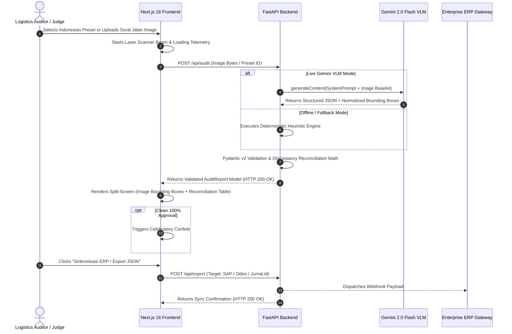

# 🏗️ SuratJalan.AI: System Architecture & Technical Design Document

> **Architecture Tier**: High-Performance Multimodal VLM Document Intelligence  
> **Target Runtime**: Docker Compose (Local Reproduction) + Vercel / Cloud Run (Production)

---

## 1. High-Level Architecture Diagram

```mermaid
graph TD
    subgraph Client["🎨 Frontend Layer (Next.js 16 + React 19 + TypeScript + Tailwind CSS)"]
        UI["Interactive Workstation UI"]
        PRESET["Preset & File Upload Selector"]
        CANVAS["Canvas Spatial Bounding-Box Overlay Engine"]
        RECON["Line-Item Discrepancy & Claim Calculator"]
        MODAL["ERP Gateway Modal (SAP, Odoo, Jurnal.id)"]
    end

    subgraph Backend["⚡ Backend API Service (FastAPI + Pydantic v2)"]
        ROUTER["API Router (/api/audit, /api/presets, /api/export)"]
        PREPROC["Image Normalization & Validation (Pillow)"]
        PARSER["Pydantic v2 Schema Enforcement & Discrepancy Math"]
    end

    subgraph AIEngine["🧠 Multimodal Intelligence Engine"]
        VLM["Google Gemini 2.0 Flash Multimodal VLM"]
        GROUND["Spatial Coordinate Bounding Box Grounding [ymin, xmin, ymax, xmax]"]
        MOCK["Zero-Config Offline Deterministic Fallback Engine"]
    end

    subgraph ERP["🏢 Enterprise Integration Gateway"]
        SAP["SAP S/4HANA BAPI Goods Receipt (IDoc / OData)"]
        ODOO["Odoo Enterprise Stock Picking API"]
        JURNAL["Jurnal.id Auto Debit Memo Webhook"]
    end

    Client -->|POST /api/audit (Multipart/Preset)| ROUTER
    ROUTER --> PREPROC
    PREPROC --> AIEngine
    AIEngine --> PARSER
    PARSER --> ROUTER
    ROUTER -->|Validated Audit Report JSON| Client
    Client -->|POST /api/export| ERP
```

---

## 2. End-to-End Audit Sequence Flow



---

## 3. Spatial Grounding Coordinate Math

Every extracted entity (stamps, signatures, line items, and retur annotations) returns normalized bounding coordinates in the range $[0, 1000]$:

$$\text{top}_{\%} = \frac{y_{\min}}{1000} \times 100, \quad \text{left}_{\%} = \frac{x_{\min}}{1000} \times 100$$
$$\text{height}_{\%} = \frac{y_{\max} - y_{\min}}{1000} \times 100, \quad \text{width}_{\%} = \frac{x_{\max} - x_{\min}}{1000} \times 100$$

This allows seamless, responsive visual rendering on any display resolution without losing precision.

---

## 4. Line-Item Reconciliation & Claim Math

For each item row $i \in \{1, \dots, N\}$:

$$\Delta_i = \text{Qty}_{\text{received}, i} - \text{Qty}_{\text{ordered}, i}$$

$$\text{Claim}_i = \begin{cases} 
|\Delta_i| \times \text{UnitPrice}_i & \text{if } \Delta_i < 0 \text{ or Status} \in \{\text{DISCREPANCY}, \text{DAMAGED}\} \\
0 & \text{if } \Delta_i = 0 \text{ and Status} = \text{MATCH}
\end{cases}$$

$$\text{TotalClaim} = \sum_{i=1}^N \text{Claim}_i$$

---

## 5. B2B Unit Economics & ROI Impact

```
+------------------------------------+-------------------------------------------+
| Metric                             | Value                                     |
+------------------------------------+-------------------------------------------+
| Average Processing Time per Doc    | 1.25 seconds (vs 10 min manual entry)     |
| AI Token Cost per Document         | ~$0.00015 (IDR 2.4 / surat jalan)         |
| Manual Admin Labor Cost            | IDR 3,500 – 5,000 / document              |
| Net Cost Reduction                 | > 99.9%                                   |
| Invoicing Delay Reduction          | From 14-30 days to Instant Same-Day       |
+------------------------------------+-------------------------------------------+
```
